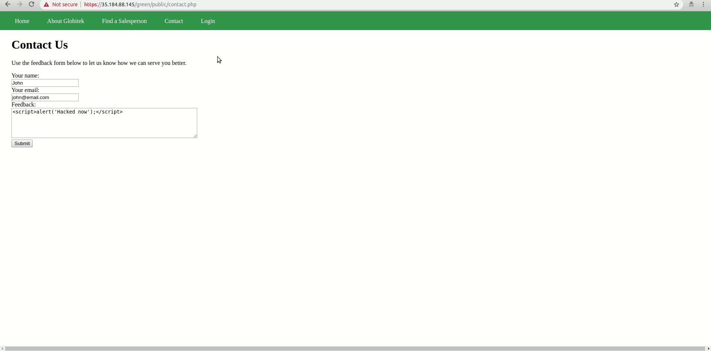
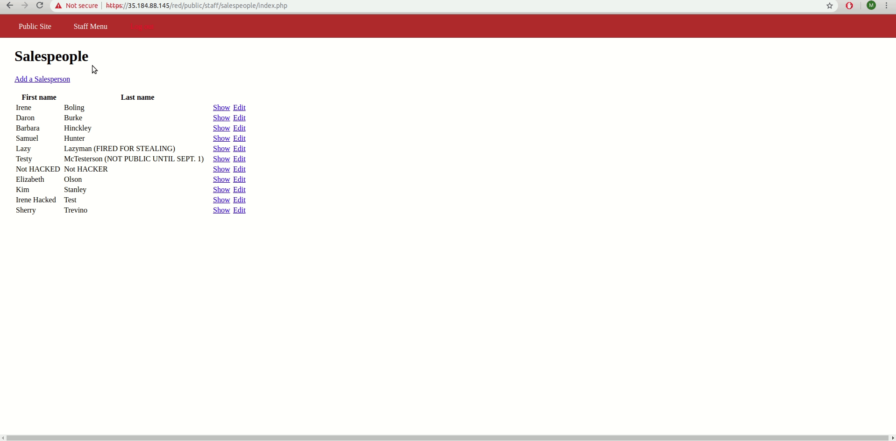

# Project 8 - Pentesting Live Targets

Time spent: **X** hours spent in total

> Objective: Identify vulnerabilities in three different versions of the Globitek website: blue, green, and red.

The six possible exploits are:
* Username Enumeration - Found Green
* Insecure Direct Object Reference (IDOR) - Found Red
* SQL Injection (SQLi) - Found Blue 
* Cross-Site Scripting (XSS) - Found Green
* Cross-Site Request Forgery (CSRF) - Found Red
* Session Hijacking/Fixation - Found Blue 

Each version of the site has been given two of the six vulnerabilities. (In other words, all six of the exploits should be assignable to one of the sites.)

## Blue

Vulnerability #1: Session Hijacking/Fixation

Steps to recreate:
  1. Log in on one browser and use the change_session_id.php script to get your session ID.
  2. On a different browser, change your session ID to match the previous one.
  3. You can now log in to the same account on the new browser without having to enter a password.
  


Vulnerability #2: SQL Injection (SQLi)

Steps to recreate:
  1. Visit the page of any sales person.
  2. In the url, instead of ```id=1```, write ```id=' OR SLEEP(5)=0--'```
  3. This causes the page to continue loading for the specified amount of time in seconds. Another thing to note is that the page always goes to "Daron Burke" regardless of who you were previously viewing. 
  


## Green

Vulnerability #1: Username Enumeration

Steps to recreate:
  1. Trying to log in with a username that exists results in bold text saying failed to log in. The text's html class is also listed as "failure".
  2. Trying to log in with a username that doesn't exist results in a non-bold text saying failed to log in. The text's html class is also listed as "failed".
  
  The green developer made different classes for a username that does exist and a username that doesn't exist. The other two developers use the same "failure" class for both cases. 
  
  

Vulnerability #2: Cross-Site Scripting (XSS)

Steps to recreate:
  1. Go to the contact tab and fill out the form with the following inside the feedback section:
  ```<script>alert('Hacked now');</script>```
  2. Now when a user logs in and checks the feedback, the script will be ran
  
Curently someone else added a script that redirects to youtube when the user checks the feedback so my script isn't ran. The other developers made it so that the text is displayed buit the script isn't ran. I will try to record the gif of my script working at a later date when the page no longer redirects. Since someone managed to redirect to youtube, I'm assuming my script would work as well. 




## Red

Vulnerability #1: Insecure Direct Object Reference (IDOR)

Steps to recreate:
  1. You can view any salesperson's page by changing the value of the id in the url

  ID 10 shouldn't be accessible by a user that is not logged in. The other two developers ensured that the page redirects when trying to access the salesperson with ID number 10.
  
  

Vulnerability #2: Cross-Site Request Forgery (CSRF)

Steps to recrete:
  1. Logging in and running the html file causes the users name to be changed according to the info entered in the html file. 
  
  


## Notes

Describe any challenges encountered while doing the work
