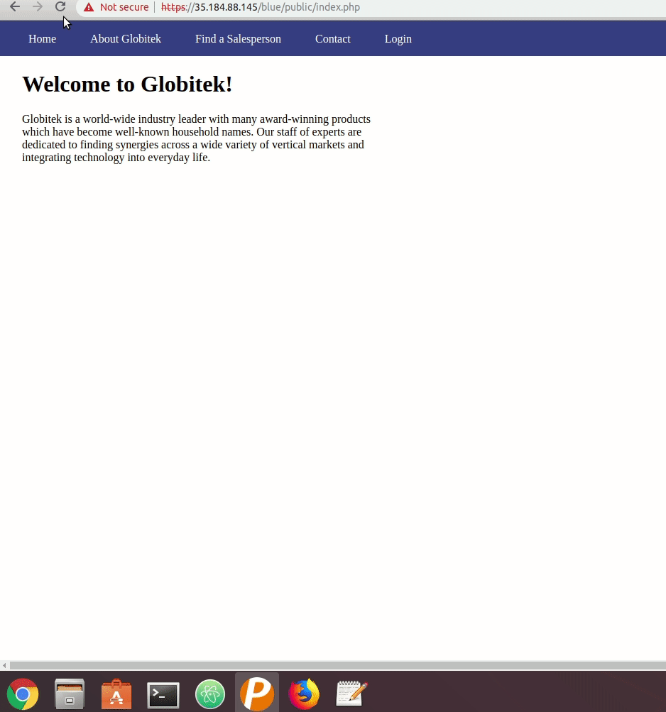

# Project 8 - Pentesting Live Targets

Time spent: **X** hours spent in total

> Objective: Identify vulnerabilities in three different versions of the Globitek website: blue, green, and red.

The six possible exploits are:
* Username Enumeration
* Insecure Direct Object Reference (IDOR)
* SQL Injection (SQLi)
* Cross-Site Scripting (XSS)
* Cross-Site Request Forgery (CSRF)
* Session Hijacking/Fixation

Each version of the site has been given two of the six vulnerabilities. (In other words, all six of the exploits should be assignable to one of the sites.)

## Blue

Vulnerability #1: Session Hijacking/Fixation

Steps to recreate:
  1. Log in on one browser and use the change_session_id.php script to get your session ID.
  2. On a different browser, change your session ID to match the previous one.
  3. You can now log in to the same account on the new browser without having to enter a password.


Vulnerability #2: SQL Injection (SQLi)

Steps to recreate:
  1. Visit the page of any sales person.
  2. In the url, instead of ```id=1```, write ```id=' OR SLEEP(5)=0--'```
  3. This causes the page to continue loading for the specified amount of time in seconds. Another thing to note is that the page always goes to "Daron Burke" regardless of who you were previously viewing. 


## Green

Vulnerability #1: __________________

Vulnerability #2: __________________


## Red

Vulnerability #1: __________________

Vulnerability #2: __________________


## Notes

Describe any challenges encountered while doing the work
